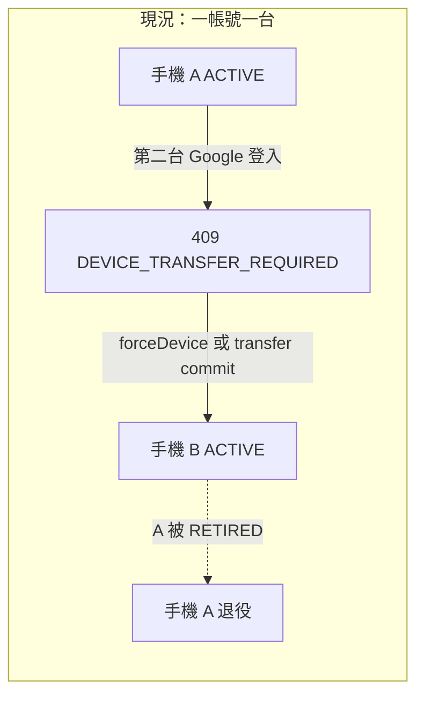
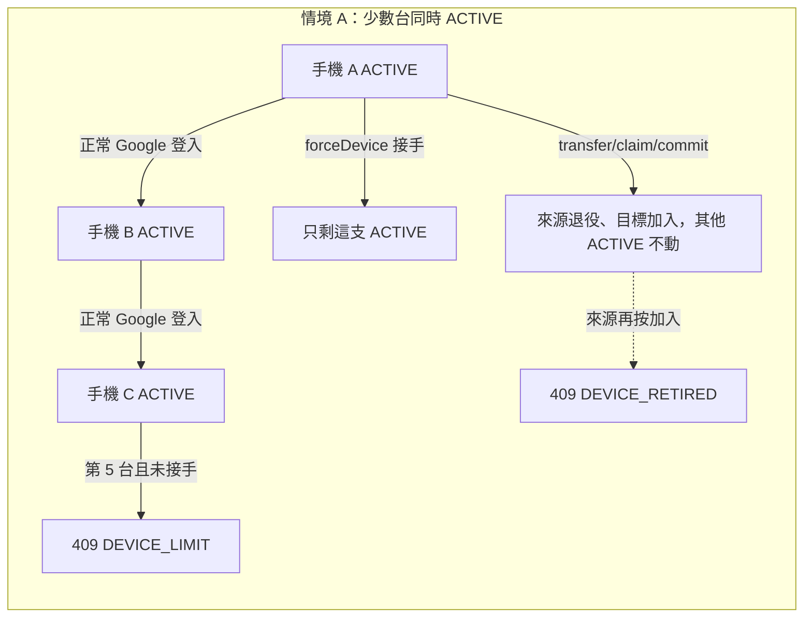
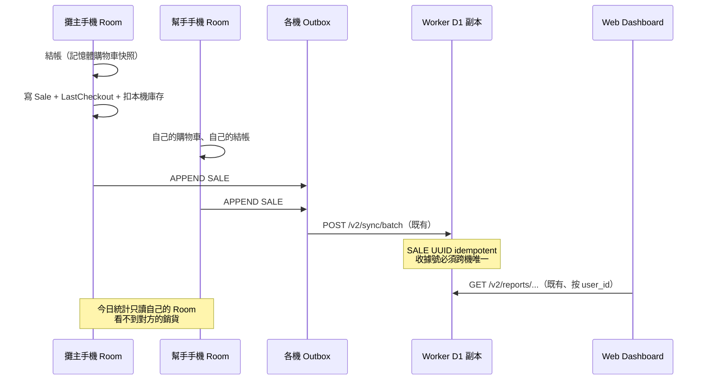
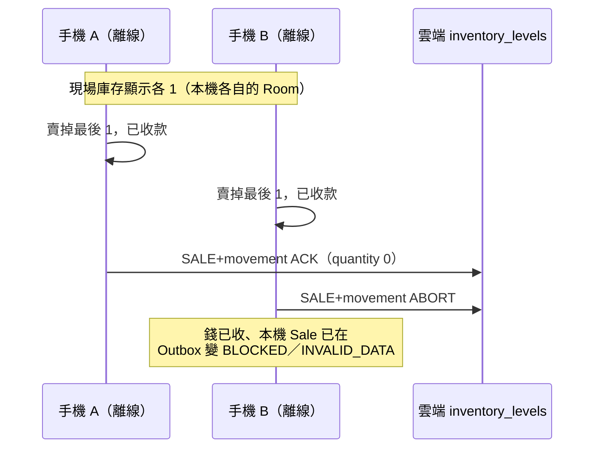
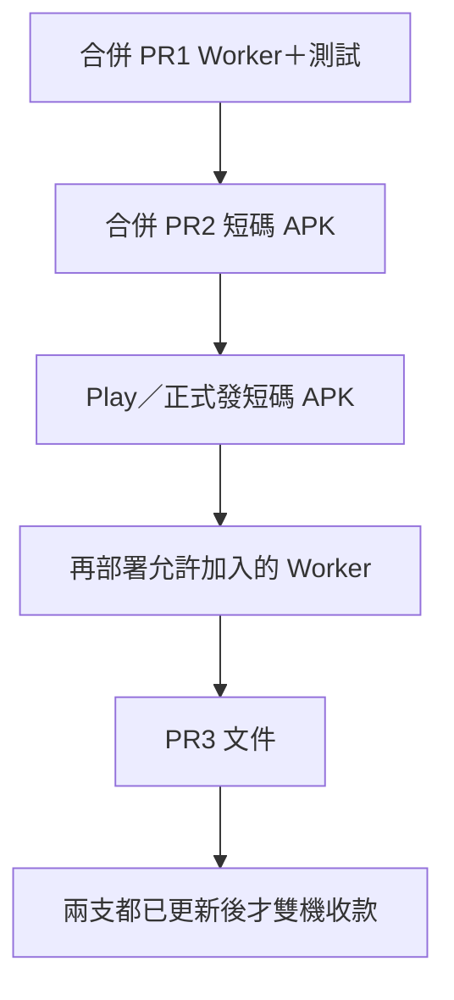

# StallPOS 情境 A：多手機並行結帳

| 欄位 | 值 |
|------|-----|
| 文件 | StallPOS 情境 A 設計規格（多手機並行結帳） |
| 作者 | TBD |
| 日期 | 2026-09-06 |
| 狀態 | Implemented |
| Repo | StallPOS / appforsale（`/Users/chenhongpu/Desktop/pos app 專案/appforsale`） |
| 原則 | Ponytail：能不寫就不寫；本機 Room 仍是結帳真相源 |

---

## Overview

攤主與幫手各拿一支手機、同一個 Google 帳號，在市集現場同時收款。今日的 Worker 用 `devices_one_active_per_user_idx` 與 `handleGoogleAuth` 的 `409 DEVICE_TRANSFER_REQUIRED` 把帳號鎖在「同一時間只能有一台 ACTIVE」。幫手那支一登入，不是被擋，就是把攤主那支退役。

情境 A 只做這件事：**允許同一個帳號底下同時有少數幾台 ACTIVE 裝置**，每台維持自己的購物車、自己的「上一筆可復原」、自己的加密 Room。銷貨仍經既有 Outbox 上推；合計營收看既有唯讀 Web Dashboard。本機「今日統計」繼續只算這支手機自己收到的錢。

不做即時庫存、不做跨機拉帳、不做共用購物車、不把雲端變成第二個結帳真相源。兩支手機同時賣掉最後一件、雲端 trigger 擋下第二筆上傳——這是接受的風險，不是本文件要解的功能。

---

## Background & Motivation

### 為什麼要改

市集攤位經常是兩個人同時收現金／行動支付。現行產品文案已經把雲端登入講成「方便換機」（`PosLocalOperationsSheet.kt`：「用 Google 登入，方便換機」），生命週期也是「一台換一台」，不是「兩台一起收」。

實際操作：幫手用同一個 Google 帳號登入 → Worker 回 `DEVICE_TRANSFER_REQUIRED` → Android 把它當成一般 `IOException` toast 出來（`CloudAccount.kt` `requireSuccess` 沒有特別處理這個 code）。沒有 Compose UI 去按 `forceDevice`，也沒有畫面去貼換機碼（`CloudAccountManager.createTransferToken` / `claimTransfer` 已寫在 data 層，但沒有任何 ViewModel／Sheet 呼叫）。

### 現行架構（runtime 真相）

離線優先：結帳寫入本機加密 Room v2（`stallpos.db`），雲端是副本。Glossary（`docs/CONTEXT.md`）：

> 雲端是副本，不是第二個結帳真相源。換機走 transfer／claim／commit；強制登入會退役舊裝置。

同步是 **push-only**：Android `SyncEngine.kt` → `POST /v2/sync/batch`（`worker/src/sync.ts` `handleSync`）。`GET /v2/bootstrap` 與 claim 回傳的 bootstrap 是給換機用的完整快照，不是現場互拉。

| 實體 | 雲端語意 | 實作 |
|------|----------|------|
| CATEGORY / PRODUCT / BUNDLE / EVENT | last-write-wins UPSERT | `sync.ts` `statementsForOperation`：`ON CONFLICT DO UPDATE`，**不比較** `updated_at_utc`，後送到的那筆贏 |
| SALE / VOID / INVENTORY_MOVEMENT | APPEND，client UUID | `processed_operations` 做 idempotent ACK；hash 不同則 `SERVER_CONFLICT` |

### 今天把多機鎖死的三處

1. **D1 部分唯一索引** `worker/migrations/pos/0002_device_lifecycle.sql`：

```sql
CREATE UNIQUE INDEX devices_one_active_per_user_idx
ON devices(user_id) WHERE status = 'ACTIVE';
```

2. **`handleGoogleAuth`**（`worker/src/auth.ts` 72–86 行）：查出該 user 任一 ACTIVE；若不是這支且 `forceDevice !== true` → `409 DEVICE_TRANSFER_REQUIRED`。`forceDevice === true` 時只退役 **LIMIT 1** 查出的那一台，並撤銷其 refresh。

3. **換機三步**（`worker/src/lifecycle.ts`）：transfer → claim（內含完整 bootstrap）→ commit。commit 把 `source_device_id` 標 `RETIRED`、撤銷其 refresh、把 target 設成 ACTIVE。這是「用這支取代那支」，不是加入。

其餘相關事實：

- 購物車是 per-device 記憶體 + debounce 寫碟（ADR-0003）；`LastCheckout` 是本機單槽（`last_checkout` 表）。兩者都維持本機、不共享。
- 每筆 Sale 已帶 `deviceId`（`RoomPosPersistence` 結帳路徑；雲端 `sales.device_id`）。Dashboard 交易明細已顯示「裝置 ID」（`dashboard-assets.ts` `showTransactionDetail` → `detailValue('裝置 ID', tx.deviceId)`）。
- 本機文案假設只有一台：`PosSyncCopy.kt` `"這支手機已被換掉，請用現在登入的那支。"`
- 契約 `contracts/v2/README.md`：Forced login 必須顯式 `forceDevice`；前一台變 `RETIRED`。
- 雲端庫存 trigger `inventory_movements_source_guard`（`0001_initial.sql`）：來源庫存不足就 `RAISE(ABORT)`。兩台離線各賣最後一件：先 ACK 的上得去，後到的本機已經收了錢，上傳 `BLOCKED`。
- 收據號本機格式 `{eventCode|GENERAL}-{shortCode}-{seq}`（`RoomPosPersistence.kt` 結帳）。**所有新裝置的 `deviceStateOrCreate` 都把 `shortCode` 寫成 `"A"`**。雲端 `sales` 有 `UNIQUE(user_id, receipt_number)`。兩台並行結帳，第二台上傳會撞號被擋——這是情境 A 若不處理就會立刻炸的正確性問題，不是錦上添花。
- Worker 寫入 `devices.short_code` 時綁的是 **device UUID**（`auth.ts` INSERT），與 Android 收據用的本機 `shortCode` 不是同一個欄位。A 不試圖把它們合成一個協定。
- Rate limit 已存在：auth 20/min、API 120/min（`wrangler.jsonc`、`ops.ts` `rateLimitResponse`）。
- 規模：典型 1 攤、2 支手機、一日數十到低百筆銷貨、Outbox 1–50 ops/batch。設計上限 **≤ 4 台 ACTIVE**。不是連鎖。

---

## Goals & Non-Goals

### Goals

- 同一 Google 帳號允許最多 N 台（建議 4）裝置同時 `ACTIVE`。
- 第二台（與第 3、4 台）Google 登入成功，**不必** `forceDevice`、**不必**走 transfer。
- 同一支手機重登仍成功（refresh 輪替、更新 `last_seen_at_utc`／名稱）。
- 每台：自己的購物車、自己的 LastCheckout／VOID、自己的 Room、自己的 Outbox。
- 既有 `POST /v2/sync/batch` 繼續上推 SALE／VOID／MASTER／INVENTORY。
- 合計營收：既有 Dashboard（已按 `user_id` 聚合所有 sales）。
- 本機「今日統計」（`PosDashboardSheet.kt` 用本機 `todayLogs`）仍是這支手機自己的銷貨。
- 換機三步保留，語意仍是「用這支取代來源那支」。
- `forceDevice` 變成明確的「這支接手」：退役**其他所有** ACTIVE，不是第二台加入的必要步驟。
- **RETIRED 裝置不能用普通加入回來**；只有 `forceDevice` 接手可把已退役列重新 ACTIVE（保住換機／接手／遺失手機）。
- 收據號跨機不得撞 `UNIQUE(user_id, receipt_number)`。
- 舊 APK 單機行為不變。**正式環境**要雙機收款時，短碼 APK 須先於或同時於「允許加入」的 Worker；見 Rollout。

### Non-Goals（明確不做）

| 代號 | 不做什麼 |
|------|----------|
| B | incremental pull，讓本機 UI 看到另一支的銷貨／庫存 |
| C | 雲端當庫存權威、預留庫存、防超賣 |
| — | 跨機共用購物車 |
| — | 跨機 VOID 別人的上一筆 |
| — | 即時庫存鎖、CRDT、WebSocket、Durable Objects |
| — | 雲端變成結帳真相源 |
| — | 目錄擁有者鎖定協定 |
| — | 新的裝置列表 API、遠端退役 UI（A 不做；遺失用接手） |
| — | 每機獨立雲端庫存 schema |
| — | Dashboard 交易列表加「裝置名稱」欄（明細已有 deviceId；YAGNI） |
| — | 新的 Worker route（除非後面證明少了就做不成；目前不需要） |

---

## Proposed Design

### 一句話

拿掉「一帳號一台 ACTIVE」的索引與 auth 閘門，讓第二台用既有 `POST /v2/auth/google` 加入；結帳、同步、Dashboard、購物車協定不改。Android 改登入路徑、收據短碼、文案、加入時清 last_checkout。換機與接手留著，但不再是加入的前置條件；已退役裝置不能靠加入復活。

### 裝置生命週期（現況 vs A）





### 現場資料流



### 1. D1 migration `0007_multi_active_devices.sql`

新檔：`worker/migrations/pos/0007_multi_active_devices.sql`

```sql
DROP INDEX IF EXISTS devices_one_active_per_user_idx;
```

不建替代的「一 user 一台」索引。`devices.status` 仍是 `ACTIVE | RETIRED`。`UNIQUE(user_id, short_code)` 維持（Worker 端 short_code 今天是 device UUID，不受本變更影響）。

Cap **不**做成 DB constraint（要改上限還得再 migration）。Cap 是 `auth.ts` 的常數 + `409`。

`ponytail:` 先 SELECT 再 INSERT，兩台同時加入可能都看到 3 台而變成 5（TOCTOU）。攤位規模可接受；若遭濫用，再加回 partial unique／或 `WHERE (SELECT COUNT(*) …) < 4` 的 INSERT 守衛。

Wrangler 會依 `migrations/pos` 目錄順序套用；測試 `worker/test/apply-migrations.ts` 已 `applyD1Migrations`，新檔會自動進測試 DB。

### 2. `handleGoogleAuth`：加入、重登、接手、上限

檔案：`worker/src/auth.ts`。**不新增 route。**

建議常數：

```ts
const MAX_ACTIVE_DEVICES = 4; // ponytail: 硬上限，沒有設定 UI；要改就改常數
```

在現有 user／tombstone／`DEVICE_CONFLICT` 邏輯之後，取代 72–86 行「找一台 ACTIVE + 409 TRANSFER」。先讀**這支**列的 `status`，再數其他 ACTIVE：

```ts
const nowUtc = new Date().toISOString();
const self = await env.POS_DB.prepare(
  "SELECT status FROM devices WHERE id = ?",
).bind(deviceId).first<{ status: string }>();

if (self?.status === "RETIRED" && body.forceDevice !== true) {
  throw new HttpError(409, "DEVICE_RETIRED", "Device is retired.");
}

const otherActive = await env.POS_DB.prepare(
  "SELECT id FROM devices WHERE user_id = ? AND status = 'ACTIVE' AND id != ?",
).bind(user.id, deviceId).all<{ id: string }>();
const otherIds = otherActive.results.map((row) => row.id);
const isNewJoin = self?.status !== "ACTIVE"; // 無列，或 RETIRED 且已帶 forceDevice
const additionalDevice = isNewJoin && otherIds.length > 0 && body.forceDevice !== true;

if (additionalDevice && otherIds.length >= MAX_ACTIVE_DEVICES) {
  throw new HttpError(409, "DEVICE_LIMIT", "Active device limit reached.");
}

const credentials = await credentialsFor(env.POS_DB, user.id, deviceId, nowUtc);
const statements: D1PreparedStatement[] = [];

if (body.forceDevice === true && otherIds.length > 0) {
  statements.push(
    env.POS_DB.prepare(
      "UPDATE devices SET status = 'RETIRED', retired_at_utc = ? WHERE user_id = ? AND status = 'ACTIVE' AND id != ?",
    ).bind(nowUtc, user.id, deviceId),
    env.POS_DB.prepare(
      `UPDATE refresh_credentials SET revoked_at_utc = ?
       WHERE user_id = ? AND revoked_at_utc IS NULL AND device_id != ?`,
    ).bind(nowUtc, user.id, deviceId),
  );
}

statements.push(
  env.POS_DB.prepare(
    `INSERT INTO devices (id, user_id, short_code, name, status, cloud_epoch, registered_at_utc, last_seen_at_utc)
     VALUES (?, ?, ?, ?, 'ACTIVE', ?, ?, ?)
     ON CONFLICT(id) DO UPDATE SET name=excluded.name, status='ACTIVE', cloud_epoch=excluded.cloud_epoch,
     last_seen_at_utc=excluded.last_seen_at_utc, retired_at_utc=NULL`,
  ).bind(deviceId, user.id, deviceId, deviceName, user.cloud_epoch, nowUtc, nowUtc),
  ...credentials.statements,
  env.POS_DB.prepare(
    `INSERT INTO audit_logs (id, user_id, device_id, request_id, action, occurred_at_utc)
     VALUES (?, ?, ?, ?, ?, ?)`,
  ).bind(
    crypto.randomUUID(),
    user.id,
    deviceId,
    requestId,
    additionalDevice ? "AUTH_DEVICE_JOIN" : "AUTH_LOGIN",
    nowUtc,
  ),
);
await checkedBatch(env.POS_DB, statements);
return json({
  requestId,
  ...credentials.response,
  userId: user.id,
  deviceId,
  cloudEpoch: user.cloud_epoch,
  additionalDevice,
}, 200, requestId);
```

行為表：

| 情況 | 結果 |
|------|------|
| 帳號尚無 ACTIVE，這支第一次登入 | 200，`additionalDevice: false`，`AUTH_LOGIN` |
| 這支已是 ACTIVE（重登，不論別人在不在） | 200，不退役任何人，`additionalDevice: false`，`AUTH_LOGIN` |
| 別人已 ACTIVE、這支是**新 deviceId**、未滿 4、`forceDevice` 假 | 200 加入，`AUTH_DEVICE_JOIN`，`additionalDevice: true` |
| 這支列已是 `RETIRED`、未 `forceDevice` | `409 DEVICE_RETIRED`（換機／接手過的舊機、遺失後被接手的機，不能靠「加入」復活） |
| 別人已有 4 台 ACTIVE、這支是新的、未 `forceDevice` | `409 DEVICE_LIMIT` |
| `forceDevice: true` | 退役**所有其他** ACTIVE、撤銷其 refresh；這支 ACTIVE（含從 RETIRED 回來）。不看 cap（接手後只剩 1） |
| 這支 device UUID 已屬別的 user | 維持 `409 DEVICE_CONFLICT` |

**不再**為「已有另一台 ACTIVE」回 `DEVICE_TRANSFER_REQUIRED`。新裝置加入走 200；已退役裝置走既有 `DEVICE_RETIRED`（Android `CloudAccount.requireSuccess` 已把它當 `CloudLifecycleException`）。換機仍走 transfer 三步。

`forceDevice` 選「退役全部其他 ACTIVE」而不是「退役某一台」的理由：auth body 沒有 `retireDeviceId`；今天的實作也是「把擋路的 ACTIVE 清掉」。多機之後若只退役 LIMIT 1，接手後可能還留著第 3 台，語意含糊。接手按鈕 = 這支成為唯一 ACTIVE。要只換掉其中一台、且新機需要雲端快照，走既有 transfer（只退役 `source_device_id`）。**普通加入永不傳 `forceDevice`。**

同一支重登：`isNewJoin` 為假，不佔 cap、不當加入、不跳加入 toast。

### 3. 換機三步：保留，語意收窄為「取代來源那支」

commit 已經是（`lifecycle.ts`）：

- `UPDATE devices … RETIRED WHERE id=? AND status='ACTIVE'`（只退役 `source_device_id`）
- 撤銷該來源的 refresh
- UPSERT target 為 ACTIVE

多機時：A、B 都 ACTIVE，從 A transfer 到 C → A 退役、C 加入、**B 仍 ACTIVE**。這正是「把這支換成那支」，不是「整帳只准一台」。

**Cap：** transfer 不讀 `MAX_ACTIVE_DEVICES`——它是 1:1 取代，ACTIVE 數量不增加。**但**若來源在 commit 前已被接手成 RETIRED，今天的 unique index 會擋住「再插一台 ACTIVE」；drop index 之後這條 batch 會變成 **+1 ACTIVE**。因此 commit 要加一刀、仍非新 route：來源 `UPDATE … AND status='ACTIVE'` 的 `changes === 0` 時，**不要** UPSERT target，回 `409 TRANSFER_INVALID`。實作可先 `SELECT status FROM devices WHERE id=source`，非 ACTIVE 就丟，或檢查 UPDATE `meta.changes`。

`lifecycle.spec.ts` 的 `activeDevice()` 用 `.first()`，單機 fixture 仍過。必測：雙 ACTIVE 時 transfer 只退役來源；來源已 RETIRED 時 commit 409、ACTIVE 數不變。

Android data 層已有 `createTransferToken` / `claimTransfer` / `commitPendingTransfer`，**UI 未接**。情境 A 的最小路徑是 Google 加入 + 備份還原 + 接手；**換機碼按鈕不擋加入，另開 follow-up PR**（見 PR Plan）。

Claim 的 bootstrap 仍是完整快照（含對方已上雲的銷貨）。這是換機，不是加入；新機「今日統計」在換機後會包含雲端已有的銷貨——與今天單機換機相同，可接受。來源機之後再按「加入」會 `409 DEVICE_RETIRED`，不會自己加回來。

### 4. 同步：不改 Worker `handleSync`

`POST /v2/sync/batch` 已用 session 的 `auth.deviceId` 對 `batch.deviceId`；每台有自己的 session／refresh family。兩台上推互不阻擋，除非：

- 該裝置已被 RETIRED → 既有 `409 DEVICE_RETIRED` / sync `DEVICE_RETIRED` BLOCKED
- SALE 收據號衝突 → INSERT 失敗 → 既有 catch 變成 `INVALID_DATA` BLOCKED（必須靠下面短碼修正來避免）
- 庫存不足 trigger → 同樣 `INVALID_DATA` BLOCKED（接受的風險）
- MASTER 後寫覆蓋先寫（接受；目錄約定一台改）

`GET /v2/bootstrap` 維持換機用途。加入路徑**不呼叫** bootstrap，避免把對方銷貨拉進本機「今日統計」（那是情境 B）。

### 5. 收據短碼：本機生成時就避開 `"A"` 撞號

這是情境 A 能上線的正確性條件，不是可選 polish。

現況：

```kotlin
// RoomPosPersistence.deviceStateOrCreate
shortCode = "A"
// 結帳
val receiptNumber = "$receiptPrefix-${device.shortCode}-${(auditOrder + 1).toString().padStart(4, '0')}"
```

本機 `sale_v2_meta.receipt_number` unique 只保護單機。雲端 `UNIQUE(user_id, receipt_number)` 會在第二台上傳第一筆時爆掉。

**最小修法：** 新建 `DeviceStateEntity` 時不要寫死 `"A"`，用 device UUID 派生穩定短碼：

```kotlin
internal fun receiptShortCode(deviceId: String): String =
    deviceId.replace("-", "").takeLast(4).uppercase()
```

這**會改契約**，不是「Android only、契約不動」：

- `contracts/v2/state-records.schema.json` 與 `sync-batch.schema.json` `$defs.device.shortCode` 今日是 `"pattern": "^[A-Z]{1,3}$"`。`9F3A` 是 4 字且含數字。改成 `"^[A-Z0-9]{1,4}$"`（與實際 emit 對齊）。golden `device-state.json` 可繼續 `"A"`（舊機／已升級未重裝）。
- **已寫入 Room 的 `"A"`**：`deviceStateOrCreate` 先讀既有列，升級後的攤主機繼續 `TPE-A-0001`。
- **任何新安裝**（含攤主重裝、幫手第一台）：`TPE-{last4}-0001`，例如 `TPE-9F3A-0001`。不是「只有第二台」才改——三處 `?: "A"`（`deviceStateOrCreate`、`activateCloudSession`、`configureSyncSession`）都改成 `previous?.shortCode ?: receiptShortCode(deviceId)`。
- `PosStoreInstrumentedTest` 的 `receiptNumber.startsWith("${event.code}-A-")` 必須改（新 Room 不再保證 `A`）。放在短碼同一個 PR。
- 4 個 hex（16 bit）在 ≤4 台下碰撞可忽略；真撞了雲端仍會 BLOCKED。不在 A 做重試改號。

不把 A/B/C/D 編成 Worker 指派：Worker `devices.short_code` 已是 device UUID，與本機收據短碼**不是同一個欄位**（見 §12）。跨機協調字母需要新協定，Ponytail 不走。

### 6. Android 登入路徑

#### 6.1 第二台可以簽入

`CloudAccountManager.signIn` 預設 `forceDevice = false` 已正確——**Worker 改完後這條路就會 200**，不必為加入傳 `forceDevice`。

要改的是失敗碼與成功之後：

- `requireSuccess`：除既有 `DEVICE_RETIRED` / `CLOUD_EPOCH_REVOKED` / `ACCOUNT_DELETED` 外，把 `DEVICE_LIMIT` 也變成 `CloudLifecycleException`（可讀文案，不是 raw `DEVICE_LIMIT: Active device limit reached.`）。
- `DEVICE_TRANSFER_REQUIRED` 若仍打到舊 Worker：維持今天的 `IOException` toast，不自動重試 `forceDevice`（自動接手會退役攤主那支，是資料事故）。
- 解析可選 `additionalDevice`（舊 Worker 沒這個欄位 = false）。`CloudLoginResult` 加上 `additionalDevice: Boolean`（預設 false）。

#### 6.2 `resetBaseline`：單一布林，加入優先於換 user

現況（`CloudAccount.kt`）：

```kotlin
resetBaseline = previousUser != session.userId || intent != CloudLoginIntent.SIGN_IN || forceDevice
```

第二台第一次登入 `previousUser == null`，會 `enqueueBaseline` 把本機快照整包推進 Outbox。若幫手先還原了過期備份，LWW UPSERT 會用「現在」的 timestamp **蓋掉攤主已經上雲的目錄改價**。

唯一公式（實作與單測都用這行，不要再並列表格互斥）：

```kotlin
resetBaseline = forceDevice ||
    intent != CloudLoginIntent.SIGN_IN ||
    (!session.additionalDevice && previousUser != session.userId)
```

| 案例 | `additionalDevice` | 結果 |
|------|--------------------|------|
| 第一台 SIGN_IN（`previousUser == null`） | false | true（本機目錄／銷貨上推到空雲端，與今天相同） |
| 第 2+ 台加入，空機 | true | **false** |
| 第 2+ 台加入，剛還原備份 | true | **false**（不 dump，避免蓋攤主目錄） |
| 這支仍記著別的 `user_id`，加入已有 ACTIVE 的攤 | true | **false**（`additionalDevice` 優先：不准用換 user 當 stomp） |
| 這支已是 ACTIVE 重登 | false | false（`previousUser == session.userId`） |
| `forceDevice` 接手 | false | **true**（這支本機成為之後 LWW 來源；文案必須講會蓋雲端目錄） |
| REENABLE / CREATE_AFTER_DELETE | — | true（`intent != SIGN_IN`） |

`additionalDevice` 是既有 auth JSON 的附加欄位，不是新 route；舊 APK 忽略未知欄位（`JSONObject.session()` 只讀固定鍵）。舊 Worker 沒此鍵 → false → 第一台行為不變；第二台對舊 Worker 仍 409，走不到這條。

#### 6.3 目錄怎麼到第二台（不拉即時、不做 B）

加入**不**拉 bootstrap。第二台要賣同一批商品，操作約定：

1. 攤主在第一台建目錄（必要時先 Google 登入，讓 MASTER 上雲）。
2. 第一台「匯出備份」，第二台「還原備份」（既有 `PosSettingsSheet`；備份**不含** `device_state`，還原不會複製 device UUID）。
3. 第二台再 Google 登入加入。

備份**不是**「只有目錄」。`exportFullBackupJson` / `replaceBusinessData` 會寫入 `sales_log`、`cart`、**以及** `last_checkout`（`RoomPosPersistence.kt` `snap.lastCheckout?.let { dao.replaceLastCheckout(...) }`）。Undo 就是這個槽（`undoLastCheckout` → Outbox `VOID`）。若加入後留著這個槽，幫手按「復原上一筆」會上傳對**攤主那筆 Sale** 的 VOID；雲端 `UNIQUE(user_id, sale_id)` 讓 Dashboard 顯示作廢，攤主 Room 看不到（無 pull）——違反 Non-Goal「跨機 VOID 別人的上一筆」。`additionalDevice` 跳過 `resetBaseline` 只避免 `enqueueBaseline`，**不會**拿掉已在本機的 last_checkout。

因此加入成功且 `additionalDevice == true` 時：

1. Room：`dao.deleteLastCheckout()`（堵住跨機 VOID）。
2. **購物車兩層都清**：還原會把 cart 寫進 ViewModel（`PosBackupRestore.applyPostBackupRestore` → `posCartMemory.value = cart`）。ADR-0003：結帳讀記憶體，Room 只是 debounce 槽。只 `dao.deleteAllCartItems()` 不夠，幫手仍會看到並結出攤主的車。
   - 在 `PosViewModel.signInWithGoogleIdToken` 成功且 `additionalDevice` 時呼叫既有 `clearCart()`（`PosViewModelCartCheckout.kt`：`posCartMemory.value = PosCart()` + `posStore.clearCart()`）。
3. **不**刪 sales／reversals（今日統計含備份銷貨的 caveat 仍在；不做 catalog-only exporter）。

文案：還原後不要按「復原上一筆」（槽已清，按鈕應無作用；仍寫一句避免以為還原＝可幫攤主改帳）。

其他後果（不當 bug）：

- 還原會帶入備份當下的銷貨，第二台「今日統計」可能含攤主已發生的交易。建議開攤前還原。
- 還原後兩台都改目錄 → LWW，後上傳的贏。文案：目錄與活動請只在一台改。
- 不還原、手動重建商品 → 新 UUID，Dashboard 會把同一品名拆成兩條。不建議。

不做「加入時只拉 PRODUCTS/BUNDLES/EVENTS」：那會讓 `GET /v2/bootstrap` 變成 live pull 的腳。不做 catalog-only 備份格式。

#### 6.4 購物車、LastCheckout、VOID

結帳路徑不改：`PosCartCoordinator` 記憶體 + debounce、`replaceLastCheckout`、`PosUndoCoordinator` 仍是**這支手機自己結的**上一筆。跨機 VOID 的破口用加入時清 last_checkout 堵住；攤主購物車殘留用 `clearCart()` 堵住。PR2 必測：還原備份 → 以 additional 加入 → `last_checkout` 空、**`posCartMemory` 為空**、outbox 沒有 VOID。

#### 6.5 UI 狀態表（接手必須出現在會用到它的每一個畫面）

雲端區在 `LocalOperationsBottomSheet`。今日 Google 鈕只在 `SyncUiStatus.LOCAL_ONLY`（`PosLocalOperationsSheet.kt`）。沒有登出：`CloudAccount.delete` 只做 Cloud／Account Delete。`PosApp.onGoogleSignIn` 永遠 `forceDevice=false`。

接手後，被退役的那支**不是** `LOCAL_ONLY`：`ACCESS_TOKEN` 還在，後續 sync 把 outbox 標 `DEVICE_RETIRED`，`syncStateFlow`（`RoomPosPersistence.kt`）走 `accessToken != null && blockedCount > 0` → **`BLOCKED`**。重裝會換新 UUID，變成新裝置加入，**救不回**這列 RETIRED，這支 Room 之後的結帳仍會 409→BLOCKED。文案已寫「要回來只能接手」——按鈕必須在這個畫面，不是「可再放」。

| 本機狀態 | 雲端區按鈕（A 必做，不是「可」） | 不做（follow-up） |
|----------|--------------------------------|-------------------|
| `LOCAL_ONLY` | **加入**（`forceDevice=false`）＋ **接手**（確認 dialog → `forceDevice=true`） | 貼換機碼 |
| `BLOCKED` 且 `blockedCode == DEVICE_RETIRED` | **接手必做**（同一確認 dialog）；**隱藏加入**（同一 `deviceId` 再加入只會再 409 `DEVICE_RETIRED`） | 產生換機碼 |
| 其他已登入（`SYNCED`／`PENDING`／其他 `BLOCKED`） | **接手**（同一確認 dialog） | 產生換機碼 |

把 `forceDevice` 從 `PosApp` 穿到 `PosViewModel.signInWithGoogleIdToken(idToken, forceDevice: Boolean = false)`。加入成功 toast 僅當 `additionalDevice`（重登不跳加入句）。

接手確認 dialog（Google 帳號選擇器不算確認）：「這會退役其他所有手機，這支上的目錄會蓋掉雲端。確定？」

PR2 必測：`SyncUiState(BLOCKED, blockedCode=DEVICE_RETIRED)` 的雲端區**有接手、無加入**。

`DEVICE_LIMIT` 文案講畫面上真的有的動作：在這支按接手。不寫「請先停用其中一台」。換機碼是 follow-up。

### 7. 目錄／活動：LWW + 約定，不加鎖

`sync.ts` PRODUCT／BUNDLE／EVENT UPSERT 沒有 `excluded.updated_at_utc > …` 守衛。兩台同時改價，後 ACK 的贏，先 ACK 的本機還顯示自己的價，直到——永遠，因為沒有 pull。

A 的產品規則：一台改目錄與活動。Settings／雲端區一行字。不加 catalog-owner token、不加 CAS。

本地「同一時間最多一個進行中活動」只在各機 Room 執行（`changeEventStatusInternal`）。雲端 `events_user_status_idx` 不是 unique。兩台各開不同活動，雲端可以出現兩個 ACTIVE。用同一句「活動也只在一台改」覆蓋。

### 8. 庫存追蹤：接受超賣，建議關掉

不改 `inventory_movements_source_guard`，不引入 per-device stock。



操作緩解（文件 + 加入時一句警告；預設要做，見 PO confirm）：

- 多機當日把商品 `trackInventory` 關掉；或
- 事前把數量拆到兩台本機（約定，不是系統保證）。

Dashboard 營收仍對，因為 SALE 在本機已成立；被擋的是雲端庫存移動。被 BLOCKED 的那筆不會出現在 Dashboard——這是比「超賣」更糟的不一致：**錢在本機、雲端沒有這筆**。A **不假裝修好**。緩解仍是：多機時關掉追蹤（Sale 的 `inventoryMovements` 為空，不打 trigger），或接受偶爾要對帳。

若追蹤開啟且 `additionalDevice` 登入：toast 一句庫存警告（本機是否有 `trackInventory == true`）。預設做；PO 若覺得吵可改成只留說明文字。

### 9. Cap = 4

`MAX_ACTIVE_DEVICES = 4` 寫在 `auth.ts`。沒有設定 UI、沒有遠端 config。滿了 `409 DEVICE_LIMIT`。RETIRED 不占名額。要改上限就改常數（測試一起改）。

### 10. Dashboard

`handleEventReports` / 交易列表已按 `user_id` 聚合，不濾 `device_id`。兩台上推的 SALE 都會出現。明細已有 `deviceId`。

**不加**列表「裝置名稱」欄：列表 query（`reports.ts` `TransactionListRow`）沒有 join `devices.name`；為一個欄去改契約與 CSV 超出 A。對帳看明細的裝置 ID 或收據短碼即可。

### 11. 文案（繁中，實作時用這些字）

放在 `PosSyncCopy.kt` 與 `PosViewModel` toast，方便單測。

| 情境 | 文案 |
|------|------|
| 第一台登入成功／重登 | `Google 雲端登入成功`（維持；**不要**在已 ACTIVE 重登時用加入句） |
| 第二台加入成功（僅 `additionalDevice`） | `這支手機已加入同一帳號。購物車與今日統計只算這支；全部營收請到網頁看。` |
| 雲端區說明（已登入） | `這支是其中一台收銀機。其他手機收的錢不會出現在這支的今日統計。` |
| 目錄約定 | `目錄與活動請只在一台改。` |
| 加入 vs 接手 | `加入：多支都能收錢。接手：把帳換到這支並退役其他所有手機。` |
| 按鈕：加入（僅 `LOCAL_ONLY`） | `用 Google 登入，加入此帳號`（取代「方便換機」；`DEVICE_RETIRED` 畫面不顯示） |
| 按鈕：接手（`LOCAL_ONLY`、`DEVICE_RETIRED`、其他已登入都要有） | `把帳換到這支並退役其他所有手機` |
| 接手確認 dialog | `這會退役其他所有手機，這支上的目錄會蓋掉雲端。確定？` |
| `DEVICE_RETIRED` | `這支手機已被換掉或接手，請用還在用的那支。`（這支再按加入不會復活；要回來只能接手） |
| `DEVICE_LIMIT` | `這個帳號已有 4 支手機在用。請在這支按「接手」（會退役其他所有手機）。` |
| 庫存警告（預設做） | `有開庫存追蹤時，多支手機可能賣超；超賣那筆可能已經收了客人的錢，但傳不進雲端。多機請關閉庫存追蹤，或事先把數量拆開。` |
| 還原後加入 | `還原後今日統計會含備份裡的銷貨。上一筆復原已清除，請不要幫別的手機改帳。` |

### 12. 契約與 glossary

`contracts/v2/README.md`「Auth, device, and deletion lifecycle」改為：

- 同一帳號最多 N 台 ACTIVE（Worker 常數，預設 4）。
- 第二台 `POST /v2/auth/google` 不必 `forceDevice`、不必先 transfer。
- **RETIRED 列不能靠普通登入變回 ACTIVE**；回 `409 DEVICE_RETIRED`。只有 `forceDevice: true` 可把已退役裝置救回並退役其他所有 ACTIVE。
- 正常換機仍是 transfer／claim／commit，只退役來源裝置；來源已 RETIRED 則 commit `TRANSFER_INVALID`，避免 +1 ACTIVE。
- Auth 200 可含 `additionalDevice`（boolean，**僅此次是新加入**時為 true）。舊客戶端忽略。
- 新穩定錯誤碼 `DEVICE_LIMIT`（409，auth，不是 sync BLOCKED code）。
- `DEVICE_TRANSFER_REQUIRED` 不再是第二台加入的正常回應。
- **本機收據 shortCode 是 client-owned**（Room `device_state.short_code`，pattern `^[A-Z0-9]{1,4}$`）。Worker `devices.short_code` 仍是 device UUID。兩者不是同一個欄位，不要從 Worker 指派 A/B/C。

`docs/CONTEXT.md`「雲端同步與換機」改成：換機仍走 transfer／claim／commit；同一帳號可有少數台同時 ACTIVE；已退役裝置不會因再次 Google 登入而加入；強制接手（`forceDevice`）才會退役其他裝置並可救回已退役列。本機今日統計不合併其他裝置。本機收據短碼與 Worker `devices.short_code` 不是同一欄。

Sync BLOCKED enum **不必**加 `DEVICE_LIMIT`。`state-records.schema.json` / `sync-batch.schema.json` 的 `shortCode` pattern **要**加寬（與短碼同一里程碑，見 PR2）。

---

## API / Interface Changes

**沒有新 path。** 既有：

| Method | Path | A 的變化 |
|--------|------|----------|
| POST | `/v2/auth/google` | 允許多 ACTIVE；RETIRED 非 force → `DEVICE_RETIRED`；滿額 `DEVICE_LIMIT`；`forceDevice` 退役全部其他；回應加 `additionalDevice`（僅新加入） |
| POST | `/v2/auth/refresh` | 無（仍綁單 device 的 refresh family） |
| POST | `/v2/devices/transfer` | 無 |
| POST | `/v2/devices/transfer/claim` | 無 |
| POST | `/v2/devices/transfer/commit` | 來源已非 ACTIVE 時 `409 TRANSFER_INVALID`，不插入 target |
| POST | `/v2/sync/batch` | 無 |
| GET | `/v2/bootstrap` | 無（加入不呼叫） |
| GET | `/v2/reports/...` | 無 |

Auth 請求 body 仍只允許：`idToken`, `deviceId`, `deviceName`, `intent`, `forceDevice`（`auth.ts` 已知鍵白名單）。

Auth 200 附加：

```ts
{
  additionalDevice?: boolean  // true = 這次把本機從「無列」變成 ACTIVE，且當時已有其他 ACTIVE
}
```

---

## Data Model Changes

### D1

- Drop `devices_one_active_per_user_idx`。
- 表結構不變。`audit_logs.action` 多一個字串值 `AUTH_DEVICE_JOIN`（沒有 CHECK constraint，不必 migration）。
- `sales.receipt_number` 的 unique 維持——靠 Android 短碼避免衝突，不放寬 unique。

### Android Room

- 不升 schema version。`device_state.short_code` 既有欄位，只改**新建列**的預設值（已存在的 `"A"` 不動）。
- 加入（`additionalDevice`）時清 `last_checkout`，並由 ViewModel `clearCart()` 清 `posCartMemory` + Room cart；sales 列保留。
- 契約 `shortCode` pattern 加寬到 `^[A-Z0-9]{1,4}$`（PR2，與短碼同一里程碑）。

### 遷移策略（合併順序 ≠ 正式上線順序）

- **Git／CI：** PR1（Worker）可先合，讓測試 DB 先有 0007。PR2 Android 對舊 Worker 加入仍 409，不自動 `forceDevice`。
- **正式／Play：** 先發（或同時發）含短碼的 APK，**再**讓 production Worker 接受第二台加入。Worker-first 在 production 等於允許兩台舊 APK 都 200、都印 `…-A-0001`，第二筆 SALE `INVALID_DATA`。這不是可接受的 live 狀態。
- Staging 閘門含「兩個 old-APK-shaped client、短碼都是 A」= **won't-fix window**，不得當成 staging 通過條件。

### Rollback

- 應用層 auth 可回退（再擋第二台）。
- **不可以**在已經有兩列 `status='ACTIVE'` 時把 unique index 加回去：D1 會建索引失敗。必須先把多餘裝置 RETIRED，才能重建 `devices_one_active_per_user_idx`。Runbook 寫這句。

---

## Alternatives Considered

### 1. 雲端當結帳真相源／跨機拉帳（情境 B 或更重）

讓本機「今日統計」與庫存看到另一支的銷貨。需要 pull、衝突、離線合併。違反 offline-first 與 Ponytail，也超出 A 的產品定義。**否決。** Dashboard 已是合計營收的正確位置。

### 2. 維持一台 ACTIVE，現場用「快速換機」

兩人搶同一 ACTIVE：每次接手退役對方，Outbox 被 `DEVICE_RETIRED` 永久擋住，未上傳銷貨卡死。比現況更糟。**否決。**

### 3. 目錄擁有者鎖 / CAS

可減少 LWW 互蓋。要新的 device 角色、失敗 UX、離線誰能改價。一行「請只在一台改」覆蓋 1 攤 2 機。**否決**，直到 PO 證明文案不夠。

### 4. Worker 指派收據字母 A/B/C/D

收據較好看。但舊機本機已固定 `"A"`，而 Worker `short_code` 存的是 UUID，兩邊對不上；要指派就得在 auth 回應短碼、處理 RETIRED 字母是否回收、改契約。4 hex 後綴零協定就能保證 unique。**本階段否決**；若 PO 強烈要 `TPE-B-0001` 這種格式，再單開 polish。

### 5. 加入時一次性 bootstrap 目錄（不含銷貨）

空的第二台不必還原備份就能賣同一 UUID。`GET /v2/bootstrap?group=PRODUCTS` 已存在。一旦做了，庫存為什麼不拉、銷貨為什麼不拉，會立刻變成 B。**否決。** 用既有匯出／還原。

### 6. `forceDevice` 只退役「某一台」或「上一台」

auth 沒有目標 id；LIMIT 1 在多機下是隨機的。接手 = 全部其他退役。要精準取代某一台且需要快照，用 transfer。**選全部退役。**

---

## Security & Privacy Considerations

| 風險 | 嚴重度 | 緩解 |
|------|--------|------|
| 同一 Google 帳號被幫手拿到後可加入最多 4 台、讀寫同一雲端副本 | 中（既有帳號模型） | 沒有新的授權邊界。A 不做裝置列表。遺失的手機：接手退役其列；該機再 Google「加入」維持 `DEVICE_RETIRED`，不會自己回來 |
| `forceDevice` 可一次踢掉所有其他機 | 高（誤觸） | 不當成登入預設；獨立按鈕；確認 dialog（目錄也會蓋雲端）；再走一次 Google |
| 換機碼 10 分鐘持有者可拿走來源裝置身份 + 完整 bootstrap | 高（既有） | A 不接 UI；follow-up 再講。不放寬過期 |
| 第二台 `resetBaseline` 蓋目錄 | 高 | `additionalDevice` 時公式為 false；接手才 dump，且文案寫明會蓋雲端目錄 |
| 還原備份後 VOID 攤主的上一筆 | 高 | `additionalDevice` 加入時 `deleteLastCheckout()`（+ 清 cart） |
| 收據／UUID 列舉 | 低 | 短碼不是秘密；device UUID 已在明細 |
| Rate limit | 低 | 維持 20/min auth、120/min API；4 機 × 低百筆／日遠低於上限 |
| PII | — | 不新增 email；Sentry 仍 `sendDefaultPii: false`；audit 只多 action 字串 |

威脅模型沒有變成「多租戶 POS」：仍是一個攤、一個 Google 帳號。不做裝置間互相授權。

---

## Observability

沿用 `ops.ts` `operationalAlert` / Sentry `ops_alert` tag，不新做 metrics stack。

| 事件 | 既有？ | A |
|------|--------|---|
| `AUTHORIZATION_FAILURE` | 401／403（`index.ts`） | 不變。`DEVICE_LIMIT` 是 409，不會進這條 |
| `SYNC_BLOCKED` | 含 `DEVICE_RETIRED`、庫存／收據 `INVALID_DATA` | 多機超賣或收據撞號會讓這條變多，應用既有 dashboard 看 code |
| `audit_logs` | `AUTH_LOGIN`、`DEVICE_TRANSFER_COMMIT`、`SYNC_APPLY` | **僅新加入**寫 `AUTH_DEVICE_JOIN`；已 ACTIVE 重登維持 `AUTH_LOGIN` |
| `AUTH_DEVICE_JOIN` 頻率 | 新 | 查 D1 `action='AUTH_DEVICE_JOIN'` 即可，不進 Sentry（不是故障） |

不為每次加入打 Sentry warning，避免把正常幫手登入當 alert。

---

## Rollout Plan



1. **合併／CI：** PR1 可先合（測試要綠）。單機舊 APK 對已部署 staging Worker 仍可重登。
2. **正式 production：** **先（或同時）發短碼 APK，再讓 Worker 接受第二台。** 不可 live 於「Worker 已允許多 ACTIVE × 兩台舊 APK 短碼都是 A」。
3. 發布說明：兩台都更新前不要雙機收款。
4. Staging：兩支**新 APK** 同一 Google、並行結帳、Dashboard 兩筆都在、各機今日統計只有自己的、第四台加入成功、第五台 `DEVICE_LIMIT`、接手後只剩一台且舊機 `DEVICE_RETIRED`、RETIRED 再加入仍 409、transfer 在雙 ACTIVE 下只退役來源、來源已 RETIRED 的 commit 409。兩個 old-APK-shaped A/A 收據衝突是 **won't-fix window**，不是通過條件。
5. **Rollback**：回退 Worker 程式可再擋加入；**不可**直接重建 unique index。先 `UPDATE devices SET status='RETIRED' …` 留一台 ACTIVE。

Feature flag：不做。Cap 是常數。

---

## Risks

| 風險 | 嚴重度 | 緩解 |
|------|--------|------|
| 雙機 + `track_inventory`：本機已收款、雲端 BLOCKED | 高（接受） | 建議關追蹤；可選登入警告；BLOCKED 走既有「回報給開發者」 |
| 舊 APK × 兩台：收據 `…-A-0001` 撞號 | 高 | **production 先 APK 後 Worker**；staging 不把 A/A 當通過 |
| 目錄 LWW 互蓋、兩台各開一個 ACTIVE event | 中 | 文案約定；不加鎖 |
| 還原備份讓幫手今日統計含舊銷貨 | 中 | 文件說明；不做 catalog-only export |
| 還原備份後 VOID 攤主上一筆 | 高 | 加入時清 `last_checkout`；PR2 必測 |
| 還原後加入仍 dump baseline | 高 | `resetBaseline` 公式 + PR2 矩陣 |
| 接手從幫手舊備份 LWW 蓋目錄 | 中 | 確認 dialog 寫明「這支目錄會蓋雲端」 |
| RETIRED 機自己加入 | 高（已堵） | 非 `forceDevice` → `409 DEVICE_RETIRED` |
| Rollback 重建 unique index | 高 | Runbook；先退役多餘裝置 |
| 幫手未還原目錄、空機加入 | 低 | 賣不了商品；不自動 pull |

---

## Open Questions（已拍板 2026-09-06）

1. **ACTIVE 上限 = 4**（常數，無 UI）。第 5 支 `409 DEVICE_LIMIT`，文案請在這支按接手（會退役其他所有手機）。
2. **庫存警告：** 第二台加入若有追蹤庫存 → **dialog 一次**（不只 Toast）。結帳時若多機且車內有追蹤庫存商品再 Toast 一次。超賣被雲端擋下的單本機保留並標「待處理」。多機模式請關閉庫存追蹤。
3. **接手退役全部其他 ACTIVE。**
4. **短碼：** 新機用 deviceId 後 5 hex，避開保留字 `A`；撞號靠雲端 unique + 待處理。
5. **退役後鎖結帳：** 下次同步 `DEVICE_RETIRED` 後不能再收款（不做即時推送）。
6. **目錄：** 文案強調只在一台改、先確認另一台沒有未同步修改（不做上傳前版本比對）。
7. **新手機加入：** 擁有者下次同步／refresh 時 Toast「有另一支手機加入這個帳號」（不做推播）。

---

## UX copy proposals（彙整給 PO 審）

見 Proposed Design §11。核心句：

- 加入成功：「這支手機已加入同一帳號。購物車與今日統計只算這支；全部營收請到網頁看。」
- 加入 vs 接手：「加入：多支都能收錢。接手：把帳換到這支並退役其他所有手機。」
- 退役：「這支手機已被換掉或接手，請用還在用的那支。」（`DEVICE_RETIRED` 畫面只顯示接手、不顯示加入）
- 接手確認：「這會退役其他所有手機，這支上的目錄會蓋掉雲端。確定？」
- 庫存：「有開庫存追蹤時，多支手機可能賣超；超賣那筆可能已經收了客人的錢，但傳不進雲端。多機請關閉庫存追蹤，或事先把數量拆開。」
- 第五台：`DEVICE_LIMIT`「請在這支按『接手』（會退役其他所有手機）。」

---

## Key Decisions

1. **拿掉 `devices_one_active_per_user_idx`，不把雲端當結帳真相。** 結帳仍只寫本機 Room；雲端繼續做副本。
2. **不新增 Worker route。** 改 `handleGoogleAuth`、一個 DROP INDEX、transfer commit 在來源非 ACTIVE 時失敗。Sync／bootstrap／reports 維持。
3. **正常第二台登入不要求 `forceDevice`。** `forceDevice` 只由接手按鈕傳送，退役**所有其他** ACTIVE。
4. **Cap = 4，常數 + `409 DEVICE_LIMIT`，沒有設定 UI。** TOCTOU 接受，不做成 DB constraint。
5. **RETIRED 不能靠普通加入復活。** 非 `forceDevice` → `409 DEVICE_RETIRED`。保住換機、接手、遺失手機。
6. **本機今日統計不合併。** 合計只在既有 Dashboard。不做 pull（B）。
7. **目錄／活動：LWW + 一行文案，不加擁有者鎖。** 接手會 dump 本機目錄——確認 dialog 寫明會蓋雲端。
8. **庫存超賣是接受的風險。** 建議關 `trackInventory`；加入時預設 toast 警告。
9. **收據短碼 client-owned：新列用 deviceId 後 4 hex；已存在的 `"A"` 不動。** 契約 `shortCode` 加寬為 `^[A-Z0-9]{1,4}$`。Worker `devices.short_code` 仍是 UUID，不是收據短碼。
10. **`resetBaseline = forceDevice || intent != SIGN_IN || (!additionalDevice && previousUser != session.userId)`。** 加入永遠不 dump；換 user 若同時是加入也不 dump。
11. **`additionalDevice`／`AUTH_DEVICE_JOIN` 只在這次把「無列」變成 ACTIVE 且已有其他 ACTIVE。** 已 ACTIVE 重登是 `AUTH_LOGIN`、`additionalDevice: false`。
12. **備份還原不是純目錄。** `additionalDevice` 加入時 `deleteLastCheckout()`，並呼叫既有 `clearCart()`（`posCartMemory` + Room），堵住跨機 VOID 與攤主購物車殘留。
13. **接手按鈕依 sync 狀態必現：** `LOCAL_ONLY`＝加入＋接手；`BLOCKED && DEVICE_RETIRED`＝只要接手、隱藏加入；其他已登入＝接手。被退役的手機仍持有 token，不會回到 `LOCAL_ONLY`。
14. **Dashboard 不加裝置名稱欄。** 明細已有 deviceId。
15. **換機碼 UI 是 follow-up PR，不擋加入。** A 最小路徑：Google 加入 + 備份還原 + 接手。
16. **正式上線：短碼 APK 先於或同時於允許加入的 Worker。** 合併順序可以 Worker 先；production 不行。
17. **Rollback 不可直接加回 unique index。** 必須先清多餘 ACTIVE。
18. **Observability 用既有 Sentry tag + `AUTH_DEVICE_JOIN` audit，不新做 metrics。**

---

## PR Plan

每個 PR 可獨立 review、獨立合併。Worker 測試跟行為走，避免 PR1 CI 綠燈但收據 invariant 沒人測。

### PR1 — Worker：允許多台 ACTIVE

- **標題：** `Allow multiple ACTIVE devices per account`
- **檔案：**
  - `worker/migrations/pos/0007_multi_active_devices.sql`（新）
  - `worker/src/auth.ts`（cap、加入、RETIRED 擋加入、`forceDevice` 退役全部其他、`additionalDevice` 僅新加入、`AUTH_DEVICE_JOIN`）
  - `worker/src/lifecycle.ts`（commit：來源非 ACTIVE → `TRANSFER_INVALID`，不 UPSERT target）
  - `worker/test/auth.spec.ts`
  - `worker/test/lifecycle.spec.ts`
  - `worker/test/api.spec.ts`（雙裝置 SALE）
- **依賴：** 無
- **必測：**
  - 第二台 200 + `additionalDevice: true`
  - 已 ACTIVE 重登：`additionalDevice: false`、`AUTH_LOGIN`
  - 第五台 409 `DEVICE_LIMIT`
  - `forceDevice` 退役全部其他 + refresh 撤銷；RETIRED 列可被接手救回
  - RETIRED 非 force → 409 `DEVICE_RETIRED`
  - 同機重登不佔 cap
  - 兩台 ACTIVE 上推 `GENERAL-A-0001` 與 `GENERAL-9F3A-0001` 皆 ACK
  - 兩筆相同 `receipt_number` → BLOCKED/`INVALID_DATA`
  - 雙 ACTIVE 時 transfer 只退役 source
  - 來源已 RETIRED 時 commit 409、ACTIVE 數不變
- **內容：** Drop unique index；新 deviceId 不必 `forceDevice` 即可加入。不改 Android。**不要把這包 deploy 到 production 直到 PR2 APK 已在使用者手上（或同時發）。**

### PR2 — Android：加入、短碼、文案、接手

- **標題：** `Join as additional device; unique receipt short code`
- **檔案：**
  - `app/src/main/java/com/lambliver/stallpos/data/RoomPosPersistence.kt`（`receiptShortCode`、三處預設短碼、`additionalDevice` 時清 last_checkout）
  - `app/src/main/java/com/lambliver/stallpos/data/SyncEngine.kt`
  - `app/src/main/java/com/lambliver/stallpos/data/CloudAccount.kt`（`CloudLoginResult.additionalDevice`、`DEVICE_LIMIT`、`resetBaseline` 公式、signIn／接手）
  - `app/src/main/java/com/lambliver/stallpos/ui/PosViewModel.kt`、`PosApp.kt`（`forceDevice` 參數；`additionalDevice` 成功後呼叫既有 `clearCart()`）
  - `app/src/main/java/com/lambliver/stallpos/ui/pos/PosSyncCopy.kt`、`PosLocalOperationsSheet.kt`（狀態表：LOCAL_ONLY＝加入＋接手；`DEVICE_RETIRED`＝只要接手；其他已登入＝接手；確認 dialog；**不**做換機碼）
  - `contracts/v2/state-records.schema.json`、`contracts/v2/sync-batch.schema.json`（`shortCode` → `^[A-Z0-9]{1,4}$`）
  - `app/src/androidTest/java/com/lambliver/stallpos/PosStoreInstrumentedTest.kt`（不要再假設 `-A-`）
  - unit tests：文案、`receiptShortCode`、`resetBaseline` 矩陣、還原→加入→ last_checkout 空且 **`posCartMemory` 空**且無 VOID；`SyncUiState(BLOCKED, DEVICE_RETIRED)` 顯示接手、不顯示加入
- **依賴：** 對舊 Worker 加入仍 409（不自動 force）。production 應先於或同時於 PR1 Worker 發這版 APK。
- **內容：** 第二台當加入；新裝置收據短碼唯一；接手在 LOCAL_ONLY、DEVICE_RETIRED、其他已登入都有。**不含**產生／貼上換機碼。

### PR3 — 契約說明與 ops

- **標題：** `Document multi-active devices in v2 contract`
- **檔案：** `contracts/v2/README.md`、`docs/CONTEXT.md`、`docs/v2-ops.md`（rollback；production APK-before-Worker）、`docs/CHANGELOG.md`
- **依賴：** PR1、PR2 行為已穩定
- **內容：** 只文件。寫明本機收據短碼 client-owned、Worker `short_code` 是 device id。**不含**補測（測在 PR1／PR2）。

### PR4 — follow-up：換機碼 UI（不擋 A）

- **標題：** `Wire transfer token UI for 1:1 phone replace`
- **檔案：** `PosLocalOperationsSheet`／ViewModel 接既有 `createTransferToken`／`claimTransfer`
- **依賴：** PR2
- **內容：** 已登入「產生換機碼」、LOCAL_ONLY「貼上換機碼」。給「新機需要雲端快照、且只退役來源那支」用。不是兩台並行結帳的最小集。
