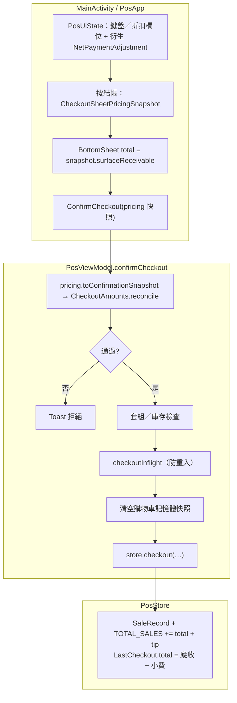

# 階段 A：結帳金額資料流與錯帳風險（盤點產出）

> **狀態**：已實作。階段 A 的「實作」＝本盤點文件（對帳語意、流程與風險可追溯）；對應程式防線見 `CheckoutAmounts.kt`、`CheckoutSheetPricingSnapshot`、`PosCheckoutCoordinator.prepare`、`PosViewModel.confirmCheckout`、`CheckoutAmountsTest.kt`、`CheckoutSheetPricingSnapshotTest.kt`、`BeginCheckoutSheetSnapshotTest.kt`。  
> **用途**：一季內優先追求「對帳正確」。

**型別詞彙（對帳時統一使用）**：`CatalogSubtotal`（目錄小計）／`NetPaymentAdjustment`（淨調整）／`AmountDue`（應收款，≥0）。UI 快照以 `CheckoutSheetPricingSnapshot`（內部 Long，派生 `surfaceReceivable`）鎖定。

---

## A1｜金額資料流（從畫面到 DataStore）

### 流程圖（Mermaid）

### 符號對照（建議對帳時心裡用同一套詞）

| 詞彙 | 計算／來源 | 對應型別 |
|------|------------|----------|
| 目錄小計（購物車） | `PosUiState.subtotal`（`productPart + bundlePart`） | `CatalogSubtotal` |
| `PosUiState.total` | **恒等於** `subtotal`（歷史命名；≠ 應收） | 同左，見 CONTEXT.md |
| 自訂金額 | `checkoutParsedCustomAmount`（`checkoutCustomDigits` 解析） | — |
| 折前合計（畫面） | `checkoutGrandBeforeDiscount` = `subtotal + customAmount` | — |
| 折扣實抵 | `checkoutDiscountApplied` | — |
| 淨調整 | `checkoutPaymentAdjustment` = `customAmount − discountApplied` | `NetPaymentAdjustment` |
| 主畫面應收預覽 | `checkoutSurfaceReceivablePreview` = `amountDue(subtotal, netAdjustment)` | `AmountDue` |
| BottomSheet 應收 | `CheckoutSheetPricingSnapshot.surfaceReceivable`（鎖定） | `AmountDue` |
| 確認對帳三數 | 快照 `catalogSubtotal`／`paymentAdjustment` + 派生 `surfaceReceivable` → `ConfirmationSnapshot` | 見 `toConfirmationSnapshot()` |
| 寫入後應收 | `Breakdown.amountDue` → `SaleRecord.total`（無小費） | `AmountDue` |
| 小費 | 現金找零吸收或行動支付 `0` | — |

### 流程（單線敘述）

1. **`PosApp`**
   - 即時預覽：`checkoutSurfaceReceivablePreview`（`CheckoutAmounts.amountDue`）。
   - 按「結帳」：`beginCheckoutSheet()` 寫入 `CheckoutSheetPricingSnapshot.lockedFrom(ui)`。
   - BottomSheet 與 `ConfirmCheckout` 共用同一 `pricing` 快照；應收顯示 `pricing.surfaceReceivable`。
   - 確認時：`pricing.toConfirmationSnapshot()` 交 Coordinator 對帳。

2. **`PosViewModel.confirmCheckout`**
   - `PosCheckoutCoordinator.prepare` 內 **`CheckoutAmounts.reconcile`**；失敗 Toast。
   - 通過後 `Breakdown.toSaleRecordAmountFields()` → `PersistInstruction` → `store.checkout`。
   - `checkoutInflight` 防重入。

3. **`PosStore.checkout`**
   - `SaleRecord`：`discount` 恒 `0`；折讓已折入淨調整。
   - `TOTAL_SALES += record.total + tip`。
   - `LastCheckout.total` = **應收 + 小費**（≠ `SaleRecord.total`）。

4. **`undoLastCheckout`**
   - 以 `LastCheckout.total`（含小費）回滾累計。

### 「誰來算錢」（精簡表）

| 步驟 | 負責模組 |
|------|----------|
| 購物車目錄小計 | `buildUiState` |
| 淨調整／應收預覽／快照 | `PosUiState` + `CheckoutSheetPricingSnapshot` |
| 對帳 | `CheckoutAmounts.reconcile` |
| 庫存／套組／persist 指令 | `PosCheckoutCoordinator` |
| 並發與 I/O | `PosViewModel`、`PosStore` |

### `SaleRecord` 在目前路徑下的實際意義

- **`SaleRecord.subtotal == SaleRecord.total`**（`discount` 恒 `0`）；淨調整已反映在應收。
- **`SaleRecord.total`** = `AmountDue`（無小費）；營收 = `total + tipAmount`。
- **`LastCheckout.total`** = 應收 + 小費。

---

## A2｜錯帳風險清單

| ID | 風險 | 嚴重度 | 說明／條件 | 狀態／建議 |
|----|------|--------|-------------|-------------|
| R1 | 「total」詞彙多義 | **中** | `PosUiState.total`、`SaleRecord.total`、`LastCheckout.total` 不同義。 | CONTEXT.md + 本表 |
| R2 | 折扣不落 `SaleRecord.discount` | **低～中** | 折扣折入 `NetPaymentAdjustment`；CSV 折扣欄恒 `0`。 | 接受現況 |
| R3 | UI 與 VM 分裂計算 | **低** | 快照 + `reconcile` 單一對帳入口。 | — |
| R4 | 非同步競態 | **低** | `CatalogSubtotal` 快照 ≠ 即時 `subtotal` → `CartChanged`。 | — |
| R5 | 重複結帳 | **低** | `checkoutInflight`。 | 已完成 |
| R6 | 舊版 `SaleRecord` | **低** | 相容預設。 | 接受現況 |
| R7 | 累計一致性 | **低** | `sum(total + tip)` 與 `TOTAL_SALES` 一致。 | `CheckoutAmountsTest` 等 |

---

## B／C（已做／可續）

- **結帳前金額**：`CheckoutAmounts` + `CheckoutSheetPricingSnapshot` + `ConfirmCheckout`。
- **防重複結帳**：`checkoutInflight`。

---

## 對應程式位置（索引）

| 區塊 | 檔案 |
|------|------|
| 型別與對帳 | `CheckoutAmounts.kt` |
| UI 快照 | `CheckoutSheetPricingSnapshot`（`PosUiContract.kt`） |
| 協調 | `PosCheckoutCoordinator.kt` |
| VM | `PosViewModel.kt`、`PosViewModelCartCheckout.kt` |
| 持久化 | `PosStore.kt` |
| 測試 | `CheckoutAmountsTest.kt`、`CheckoutSheetPricingSnapshotTest.kt`、`BeginCheckoutSheetSnapshotTest.kt` |
